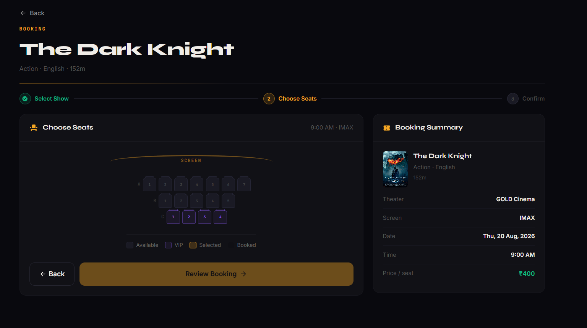
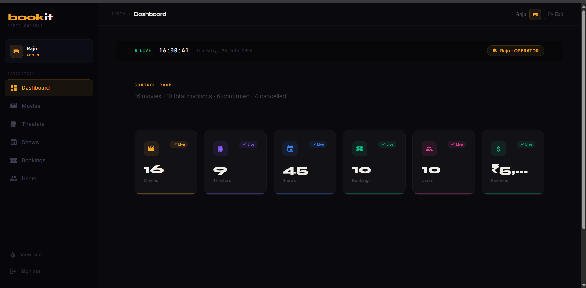

# BookIt — Movie Booking System · Frontend

<div align="center">
  <table>
    <tr>
      <td></td>
      <td></td>
    </tr>
    <tr>
      <td align="center"><em>Home</em></td>
      <td align="center"><em>Movies</em></td>
    </tr>
    <tr>
      <td></td>
      <td></td>
    </tr>
    <tr>
      <td align="center"><em>Seat Selection</em></td>
      <td align="center"><em>Admin Dashboard</em></td>
    </tr>
  </table>
</div>

<div align="center">


</div>

---

## Table of Contents

1. [Project Overview](#1-project-overview)
2. [Technology Stack](#2-technology-stack)
3. [Project Structure](#3-project-structure)
4. [Pages & Routing](#4-pages--routing)
5. [State Management](#5-state-management)
6. [API Integration](#6-api-integration)
7. [Component Architecture](#7-component-architecture)
8. [Authentication & Route Protection](#8-authentication--route-protection)
9. [Getting Started](#9-getting-started)
10. [Environment Variables](#10-environment-variables)
11. [Deployment](#11-deployment)

---

## 1. Project Overview

**BookIt Frontend** is the client-side layer of the BookIt movie booking platform. Built with **React 19** and powered by **Redux Toolkit** for global state, it communicates exclusively with the Spring Boot backend via a centralized Axios instance that handles JWT access tokens, **silent access-token refresh via an httpOnly cookie**, and centralized logout.

The application covers the full user journey — landing on the home page, browsing movies, selecting seats, completing a booking, and managing past bookings — alongside a complete admin interface for content and operations management.

### Key Capabilities

| Area | Description |
|------|-------------|
| **Movie Discovery** | Browse, search, and filter movies by genre and language |
| **Seat Selection** | Real-time seat availability on the booking page |
| **Booking Management** | Create, view, and cancel bookings from `MyBookings` |
| **Authentication** | JWT access/refresh auth with silent session recovery on 401 and on page reload |
| **Admin Panel** | Manage movies, theaters, shows, bookings, and users |
| **Route Protection** | `ProtectedRoute` component that waits for the auth bootstrap to finish before making a redirect decision — never guesses off stale state |
| **Error Boundaries** | `ErrorBoundary` component catches render-time failures gracefully |
| **Toast Notifications** | `react-toastify` for non-intrusive feedback across the app |

---

## 2. Technology Stack

### Dependencies (from `package.json`)

| Package | Version | Purpose |
|---------|---------|---------|
| `react` | **19.2.6** | Core UI library |
| `react-dom` | 19.2.6 | DOM rendering |
| `react-router-dom` | **7.18.0** | Client-side routing, nested routes |
| `@reduxjs/toolkit` | **2.12.0** | Global state management, async thunks |
| `react-redux` | 9.3.0 | React bindings for Redux store |
| `axios` | **1.18.1** | HTTP client with interceptors |
| `react-icons` | 5.6.0 | Icon library (5000+ icons) |
| `react-toastify` | **11.1.0** | Toast notification system |

### Dev Dependencies

| Package | Version | Purpose |
|---------|---------|---------|
| `vite` | **8.0.12** | Build tool & dev server |
| `@vitejs/plugin-react` | 6.0.1 | React Fast Refresh support |
| `tailwindcss` | **4.3.1** | Utility-first CSS framework |
| `@tailwindcss/vite` | 4.3.1 | Tailwind v4 Vite integration |
| `autoprefixer` | 10.5.0 | CSS vendor prefix automation |
| `postcss` | 8.5.15 | CSS transformation pipeline |
| `eslint` | 10.3.0 | Code quality linting |
| `eslint-plugin-react-hooks` | 7.1.1 | Hooks rules enforcement |
| `eslint-plugin-react-refresh` | 0.5.2 | Fast refresh linting |

### Package Manager & Runtime

| Tool | Detail |
|------|--------|
| Package Manager | **pnpm** (`pnpm-lock.yaml`) |
| Module System | ES Modules (`"type": "module"`) |
| Build Output | Vite optimized bundle |
| Deployment | **Vercel** (`vercel.json` present) |

---

## 3. Project Structure

```
BMSFRONTEND/
├── public/                          # Static assets served as-is
│
├── src/
│   │
│   ├── api/                         # HTTP layer
│   │   ├── axiosConfig.js           # Axios instance, base URL, JWT + refresh interceptor
│   │   └── endpoints.js             # Centralized API endpoint constants
│   │
│   ├── assets/                      # Static assets imported in JS/JSX
│   │   ├── hero.png                 # Hero section background
│   │   ├── react.svg
│   │   └── vite.svg
│   │
│   ├── components/                  # Reusable UI components
│   │   ├── admin/                   # Admin-only components
│   │   │   ├── AdminDashboard.jsx   # Stats overview panel
│   │   │   ├── AdminMovies.jsx      # Movie CRUD table
│   │   │   ├── AdminUsers.jsx       # User management table
│   │   │   ├── ManageBookings.jsx   # Booking management view
│   │   │   ├── ManageShows.jsx      # Show scheduling interface
│   │   │   └── ManageTheaters.jsx   # Theater/screen management
│   │   │
│   │   ├── auth/
│   │   │   └── ProtectedRoute.jsx   # Route guard — waits for auth bootstrap, then checks role
│   │   │
│   │   └── common/                  # Shared UI primitives
│   │       ├── ErrorBoundary.jsx    # React error boundary wrapper
│   │       └── LoadingSpinner.jsx   # Reusable loading indicator
│   │
│   ├── hooks/                       # Custom React hooks
│   │   └── index.js                 # Typed useAppDispatch / useAppSelector
│   │
│   ├── pages/                       # Route-level page components
│   │   ├── Home.jsx                 # Landing page with hero + featured movies
│   │   ├── Movies.jsx               # Browse all movies with search/filter
│   │   ├── MovieDetailPage.jsx      # Movie info + available shows
│   │   ├── BookingPage.jsx          # Seat selection + booking form
│   │   ├── BookingConfirmation.jsx  # Post-booking confirmation & ticket
│   │   ├── MyBookings.jsx           # User's booking history
│   │   ├── LoginPage.jsx            # Login form
│   │   ├── RegisterPage.jsx         # Registration form
│   │   ├── ProfilePage.jsx          # User profile view/edit
│   │   ├── AdminPage.jsx            # Admin panel shell
│   │   ├── AboutUs.jsx              # About page
│   │   ├── Contact.jsx              # Contact page
│   │   ├── FAQ.jsx                  # FAQ page
│   │   ├── PrivacyPolicay.jsx       # Privacy policy page
│   │   ├── TermsAndCondition.jsx    # Terms & conditions page
│   │   └── NotFound.jsx             # 404 fallback page
│   │
│   ├── store/                       # Redux store
│   │   ├── index.js                 # Store configuration, root reducer
│   │   ├── hooks/
│   │   │   └── index.js             # Typed hooks re-export
│   │   └── slices/                  # Redux Toolkit slices
│   │       ├── authSlice.js         # Auth state, login/register/logout/bootstrap thunks
│   │       ├── bookingSlice.js      # Booking creation, history, cancellation
│   │       ├── citySlice.js         # City list for theater filtering
│   │       ├── movieSlice.js        # Movie list, detail, search
│   │       ├── screenSlice.js       # Screen data per theater
│   │       ├── seatSlice.js         # Seat availability per show
│   │       ├── showSlice.js         # Show listings per movie/screen
│   │       ├── theaterSlice.js      # Theater data per city
│   │       └── uiSlice.js           # UI state (loading, modals, toasts)
│   │
│   ├── utils/                       # Utility functions
│   │   └── helpers.js               # Date formatting, price formatting, etc.
│   │
│   ├── App.jsx                      # Root component — router + layout + auth bootstrap
│   ├── App.css                      # Global app styles
│   ├── main.jsx                     # React DOM entry point
│   └── index.css                    # Tailwind base styles
│
├── .env                             # Environment variables (gitignored)
├── .gitignore
├── eslint.config.js
├── index.html                       # Vite HTML entry point
├── package.json
├── pnpm-lock.yaml
├── vercel.json                      # Vercel deployment config (SPA rewrites)
└── vite.config.js                   # Vite + React + Tailwind plugin config
```

---

## 4. Pages & Routing

### Public Routes (no auth required)

| Path | Component | Description |
|------|-----------|-------------|
| `/` | `Home.jsx` | Hero section, featured movies, quick nav |
| `/movies` | `Movies.jsx` | Full catalog with search and genre/language filters |
| `/movies/:id` | `MovieDetailPage.jsx` | Movie details, cast, showtimes |
| `/login` | `LoginPage.jsx` | Email + password login form |
| `/register` | `RegisterPage.jsx` | New user registration form |
| `/about` | `AboutUs.jsx` | About the platform |
| `/contact` | `Contact.jsx` | Contact form |
| `/faq` | `FAQ.jsx` | Frequently asked questions |
| `/privacy` | `PrivacyPolicay.jsx` | Privacy policy |
| `/terms` | `TermsAndCondition.jsx` | Terms and conditions |
| `*` | `NotFound.jsx` | 404 fallback |

### Protected Routes — `USER` role

| Path | Component | Description |
|------|-----------|-------------|
| `/booking/movie/:movieId` | `BookingPage.jsx` | Seat selection + booking creation |
| `/booking/confirmation/:bookingId` | `BookingConfirmation.jsx` | Post-booking ticket & summary |
| `/bookings` | `MyBookings.jsx` | Booking history with cancel option |
| `/profile` | `ProfilePage.jsx` | View and edit user profile |

### Protected Routes — `ADMIN` role

| Path | Component | Description |
|------|-----------|-------------|
| `/admin` | `AdminPage.jsx` | Admin panel shell + tab navigation |
| `/admin` → tab | `AdminDashboard.jsx` | Platform stats overview |
| `/admin` → tab | `AdminMovies.jsx` | Add, edit, delete movies |
| `/admin` → tab | `AdminUsers.jsx` | View and manage users |
| `/admin` → tab | `ManageBookings.jsx` | View all platform bookings |
| `/admin` → tab | `ManageShows.jsx` | Schedule and manage shows |
| `/admin` → tab | `ManageTheaters.jsx` | Manage theaters and screens |

---

## 5. State Management

The application uses **Redux Toolkit** with 9 feature slices, all wired into a single Redux store.

### Store Architecture

```
store/
└── index.js                  ← configureStore with root reducer
    └── slices/
        ├── authSlice.js      ← auth state, JWT, user info, session bootstrap
        ├── movieSlice.js     ← movie list, search, detail
        ├── bookingSlice.js   ← create/cancel bookings, history
        ├── showSlice.js      ← shows per movie or screen
        ├── theaterSlice.js   ← theaters per city
        ├── screenSlice.js    ← screens per theater
        ├── seatSlice.js      ← available seats per show
        ├── citySlice.js      ← city master list
        └── uiSlice.js        ← global loading, modal, toast state
```

### Slice Responsibilities

| Slice | State Managed | Key Thunks / Actions |
|-------|--------------|----------------------|
| `authSlice` | `user`, `token`, `authChecked`, `isLoading`, `error` | `loginUser`, `registerUser`, `logoutUser`, `bootstrapAuth`, `fetchCurrentUser`, `fetchUsers`; plain actions `tokenRefreshed`, `setUser`, `clearError` |
| `movieSlice` | `movies[]`, `selectedMovie`, `filters` | `fetchMovies`, `fetchMovieById`, `searchMovies` |
| `bookingSlice` | `currentBooking`, `bookings[]`, `status` | `createBooking`, `fetchUserBookings`, `cancelBooking` |
| `showSlice` | `shows[]`, `selectedShow` | `fetchShowsByMovie`, `fetchShowsByScreen` |
| `theaterSlice` | `theaters[]` | `fetchTheatersByCity` |
| `screenSlice` | `screens[]` | `fetchScreensByTheater` |
| `seatSlice` | `availableSeats[]`, `selectedSeats[]` | `fetchAvailableSeats` |
| `citySlice` | `cities[]` | `fetchCities` |
| `uiSlice` | `isLoading`, `activeModal`, `toastQueue` | `setLoading`, `openModal`, `closeModal` |

#### `authSlice` in detail — why it looks the way it does

The auth slice went through a real redesign after a session-expiry bug, and its current shape reflects the fix:

- **`bootstrapAuth`** — dispatched once on app mount (from `App.jsx`) and again periodically. If the stored access token looks expired, it does **not** immediately clear the session — it first attempts `POST /users/refresh-token` using the httpOnly refresh cookie, and only clears state if that also fails. This replaced an earlier version that decoded the JWT and wiped `localStorage` synchronously on module load, which never gave a refresh a chance to run.
- **`authChecked`** — a boolean that flips `true` once `bootstrapAuth` has resolved (success or failure). `ProtectedRoute` waits for this before making any redirect decision, instead of judging a possibly-stale token itself.
- **`logoutUser`** — a thunk, not a plain reducer. It calls `POST /users/logout` first (which clears the httpOnly refresh cookie server-side) and only then clears `token`/`user` from state and `localStorage`. A refresh cookie can't be deleted by client JS, so logout **must** go through the server.
- **`tokenRefreshed`** — a plain (non-async) reducer, dispatched by the axios interceptor immediately after a successful silent refresh, so `state.auth.token` never drifts out of sync with what's actually in `localStorage` and what's being sent on the wire.

### Typed Hooks

Both hooks are re-exported from `src/hooks/index.js` and `src/store/hooks/index.js`:

```js
// Use these everywhere instead of plain useDispatch / useSelector
import { useAppDispatch, useAppSelector } from '../hooks';
```

---

## 6. API Integration

### Axios Configuration (`src/api/axiosConfig.js`)

A single Axios instance is created with `withCredentials: true` (required so the httpOnly refresh cookie is actually sent) and:

- **Request interceptor** — attaches `Authorization: Bearer <token>` from `localStorage` on every outgoing request.
- **Response interceptor** — on a `401` from any endpoint other than `/refresh-token` itself, it calls `POST /users/refresh-token` exactly once per failed request (`_retry` flag prevents infinite loops), and on success: writes the new token to `localStorage`, dispatches `tokenRefreshed` so Redux stays in sync, retries the original request with the new token, and returns that result transparently to the caller. If the refresh itself fails (or `/refresh-token` returns 401), it dispatches `logoutUser` and hard-redirects to `/login`.

```js
// Simplified — see src/api/axiosConfig.js for the full implementation
axiosInstance.interceptors.response.use(
  (response) => response,
  async (error) => {
    const originalRequest = error.config;

    if (originalRequest?.url?.includes('/refresh-token')) {
      await store.dispatch(logoutUser());
      window.location.href = '/login';
      return Promise.reject(error);
    }

    if (error.response?.status === 401 && !originalRequest._retry) {
      originalRequest._retry = true;
      try {
        const res = await axiosInstance.post('/users/refresh-token', {}, { withCredentials: true });
        localStorage.setItem('token', res.data.accessToken);
        store.dispatch(tokenRefreshed(res.data.accessToken));
        originalRequest.headers.Authorization = `Bearer ${res.data.accessToken}`;
        return axiosInstance(originalRequest);
      } catch (refreshError) {
        await store.dispatch(logoutUser());
        window.location.href = '/login';
        return Promise.reject(refreshError);
      }
    }
    return Promise.reject(error);
  }
);
```

> **On the circular import:** this file imports the Redux `store` directly to dispatch `tokenRefreshed`/`logoutUser`, while `authSlice.js` imports this file to make its API calls — a three-way circular dependency (`store` → `authSlice` → `axiosConfig` → `store`). This is safe *only* because `store` is exclusively referenced inside the interceptor callbacks above, which run at request/response time — by then every module has finished loading. It would not be safe to reference `store` at the top level of this file.

### Endpoint Constants (`src/api/endpoints.js`)

All API paths are stored as constants — no hardcoded strings scattered across slices:

```js
const API = {
  AUTH_REGISTER: '/users/register',
  AUTH_LOGIN: '/users/login',
  AUTH_LOGOUT: '/users/logout',
  USERS: '/users',
  USER_BY_ID: (id) => `/users/${id}`,
  MOVIES: '/movies',
  MOVIE_BY_ID: (id) => `/movies/${id}`,
  BOOKINGS: '/bookings',
  BOOKINGS_BY_USER: (userId) => `/bookings/user/${userId}`,
  CANCEL_BOOKING: (id) => `/bookings/${id}/cancel`,
  AVAILABLE_SEATS: (showId) => `/bookings/show/${showId}/available-seats`,
  // ...full list in src/api/endpoints.js
};
export default API;
```

`/users/refresh-token` is called directly by `axiosConfig.js` and `authSlice.js` rather than via this file, since it's only ever referenced from those two auth-internal call sites.

---

## 7. Component Architecture

### Component Categories

```
components/
├── admin/       ← Admin-only, rendered inside AdminPage.jsx as tab content
├── auth/        ← Route protection logic
└── common/      ← Shared across all pages
```

### `ProtectedRoute.jsx`

```jsx
const ProtectedRoute = ({ requiredRole }) => {
  const { user, token, authChecked } = useSelector((s) => s.auth);

  if (!authChecked) return null; // bootstrapAuth hasn't resolved yet — don't guess
  if (!user || !token) return <Navigate to="/login" replace />;
  if (requiredRole && user.role !== requiredRole) return <Navigate to="/" replace />;

  return <Outlet />;
};
```

This component intentionally contains **zero** token-decoding or expiry logic of its own. It used to independently decode the JWT and redirect on every render — which meant it could log a user out even while a valid silent refresh was in flight elsewhere. Token-freshness is decided in exactly one place (`bootstrapAuth`); this component just waits for that decision and trusts it.

### `ErrorBoundary.jsx`

React class component that catches JavaScript errors in its subtree during render, preventing the whole app from crashing. Displays a fallback UI with a reload option.

### `LoadingSpinner.jsx`

Reusable centered spinner, driven by `uiSlice.isLoading`. Used across async data-fetching operations.

### Admin Components (tab-based inside `AdminPage.jsx`)

| Component | Operations |
|-----------|------------|
| `AdminDashboard` | Platform stats — total movies, bookings, revenue |
| `AdminMovies` | Add / edit / delete movies with form modal |
| `AdminUsers` | View all users, role information |
| `ManageBookings` | View all bookings across the platform |
| `ManageShows` | Schedule shows — link movie + screen + time |
| `ManageTheaters` | Add theaters and screens per city |

---

## 8. Authentication & Route Protection

### Auth State Flow — Login

```
User submits login form
  → LoginPage dispatches loginUser(credentials)
  → Axios POST /api/users/login (withCredentials: true)
  → Response body: { token, user }
    (backend also sets the refresh token as an httpOnly cookie —
     it never appears in the JSON body or in localStorage)
  → authSlice stores token + user, sets authChecked = true
  → token + user persisted to localStorage
  → ProtectedRoute reads user/token/authChecked from store
  → User redirected to intended page
```

### Auth State Flow — App Load / Reload

```
App.jsx mounts
  → dispatches bootstrapAuth() once, and again every 60s as a background check
  → bootstrapAuth reads the stored access token
      → not expired: leaves it as-is, authChecked = true
      → looks expired: attempts POST /users/refresh-token using the
        httpOnly cookie BEFORE giving up
          → success: new token written to localStorage + Redux, authChecked = true
          → failure: calls /users/logout (clears the cookie server-side too),
            clears local state, authChecked = true
  → ProtectedRoute waits for authChecked before rendering or redirecting
```

This two-path design (login vs. reload/background) exists because of a real bug: an earlier version decided "is the user logged in" synchronously at module load, before any refresh attempt could run, which logged users out on every reload once the short-lived access token expired — even though a perfectly valid refresh cookie was sitting right there.

### Auth State Flow — Mid-Session Token Expiry

```
Any authenticated API call returns 401 (access token expired)
  → axios response interceptor catches it
  → POST /users/refresh-token (httpOnly cookie sent automatically)
      → success: new token saved, original request retried transparently —
        the calling component never sees the 401 at all
      → failure: logoutUser() dispatched, redirected to /login
```

### Auth State Flow — Logout

```
User clicks "Sign out" (Home navbar / AdminPage sidebar / ProfilePage)
  → dispatch(logoutUser())
  → POST /api/users/logout → server clears the httpOnly refresh cookie
  → only then: token/user cleared from Redux + localStorage
```

> All three logout entry points must dispatch the same `logoutUser` thunk. A plain synchronous `logout` reducer that only clears `localStorage` was removed from this slice on purpose — since the refresh cookie is `httpOnly`, client JS can never delete it directly, so any logout path that skips the server call leaves a live refresh cookie behind.

### Token Persistence

The JWT **access token** and user object are stored in `localStorage` so the UI can render immediately on reload without waiting for a network round trip; the actual source of truth for whether the session is still valid is the httpOnly refresh cookie plus `bootstrapAuth`'s check, not the mere presence of a `localStorage` value.

### Route Guard Logic (`ProtectedRoute.jsx`)

```
Request hits protected route
  → authChecked === false → render nothing (bootstrap still running)
  → authChecked === true, no user/token → <Navigate to="/login" replace />
  → authChecked === true, user.role !== requiredRole → <Navigate to="/" replace />
  → otherwise → <Outlet />
```

---

## 9. Getting Started

### Prerequisites

- Node.js 20+
- pnpm (`npm install -g pnpm`)

### Install & Run

```bash
# Clone the repo
git clone https://github.com/TechFourgeBuild/BmsFrontend.git
cd BmsFrontend

# Install dependencies
pnpm install

# Start dev server
pnpm dev
```

Dev server runs at `http://localhost:5173` by default.

### Build for Production

```bash
pnpm build
```

Output goes to `dist/`. Preview the production build locally:

```bash
pnpm preview
```

### Lint

```bash
pnpm lint
```

---

## 10. Environment Variables

Create a `.env` file in the frontend root (already gitignored):

```bash
# Backend API base URL — include /api suffix
VITE_API_URL=http://localhost:8080/api

# Optional: admin registration secret if implemented
VITE_ADMIN_SECRET_KEY=your_admin_secret
```

> All Vite environment variables must be prefixed with `VITE_` to be exposed to the client bundle — that's not optional, it's the whole point of the prefix.

### Production `.env` (Vercel)

Set these in your Vercel project dashboard under **Settings → Environment Variables**:

| Variable | Value |
|----------|-------|
| `VITE_API_URL` | `https://your-backend.onrender.com/api` |

> **Gotcha we actually hit:** Vercel offers two types for env vars — **Secret** (write-only, never readable after saving, meant for values that must stay server-side) and **Config/Plain** (readable, meant for values baked into the client build). `VITE_API_URL` **must** be set as Config, not Secret. Setting it as Secret meant the value never made it into the built bundle, so the deployed app silently fell back to the code's hardcoded `http://localhost:8080/api` default — every request from production failed as a network error, which surfaced misleadingly as `"Invalid email or password"` on login because the frontend's error handler assumes a failed request without a server response means bad credentials. If login fails in production with correct credentials, check this first. Also remember: Vite bakes env vars in at **build time**, so changing this value requires a fresh deploy (not just a save) to take effect.

---

## 11. Deployment

The frontend is deployed to **Vercel** (`vercel.json` is present in the root).

### `vercel.json` — SPA Rewrite Rule

For React Router to work correctly on Vercel, all routes must be rewritten to `index.html`:

```json
{
  "rewrites": [
    { "source": "/(.*)", "destination": "/index.html" }
  ]
}
```

### Deploy Steps

```bash
# Install Vercel CLI
npm i -g vercel

# Deploy from frontend directory
vercel --prod
```

Or connect your GitHub repo to Vercel for automatic deployments on every push to `main`.

### Build Settings (Vercel Dashboard)

| Setting | Value |
|---------|-------|
| Framework Preset | Vite |
| Build Command | `pnpm build` |
| Output Directory | `dist` |
| Install Command | `pnpm install` |

### Cross-Origin Auth Checklist (Vercel frontend ↔ Render backend)

Deploying frontend and backend to different domains surfaces cookie behavior that doesn't show up in local development (where `localhost:5173` and `localhost:8080` are treated as same-site despite the different ports). Before trusting a production deploy:

- [ ] Backend's refresh cookie is set with `SameSite=None; Secure=true` (not `Strict`, which never leaves same-site)
- [ ] Backend's CORS config lists the exact deployed Vercel origin, with `allowCredentials(true)`
- [ ] `VITE_API_URL` is set as **Config**, not **Secret**, in Vercel's env var settings (see [Section 10](#10-environment-variables))
- [ ] A fresh deploy has run *after* any env var change — Vite bakes these in at build time
- [ ] Verified by inspecting the actual `Set-Cookie` response header (or the request's dedicated Cookies panel in DevTools) rather than trusting the frontend origin's Storage tab, which will never show a cookie set by a different origin

---

<div align="center">

**© 2026 BookIt. All rights reserved.**

*Built with React 19 · Redux Toolkit · Tailwind CSS · Vite*

**Repo:** [github.com/TechFourgeBuild/BmsFrontend](https://github.com/TechFourgeBuild/BmsFrontend.git)

</div>
